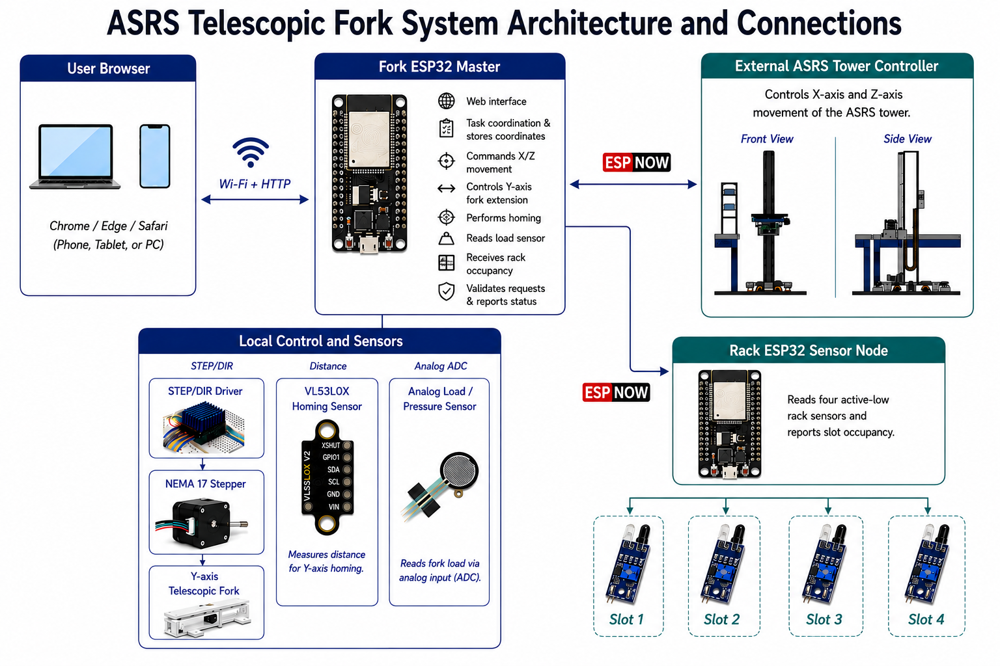
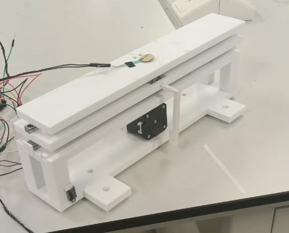
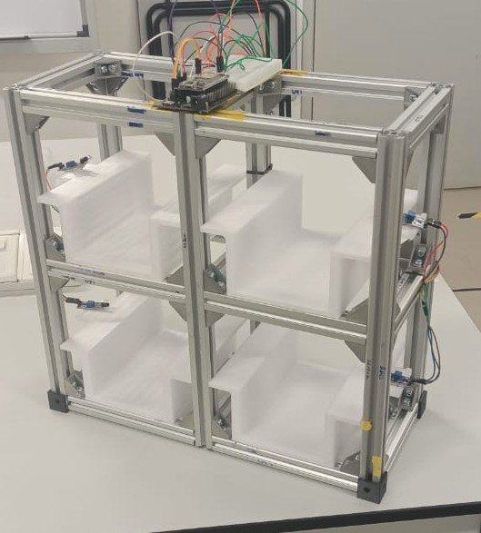

# ASRS Telescopic Fork Control

This ASRS Telescopic Fork project was developed for the Mechatronic System Design Project in UTAR’s Bachelor of Mechatronic Engineering program. It features ESP32-based web control, automated pick/place operations, ±300 mm fork travel, homing, load detection, rack monitoring, and ESP-NOW communication.

Arduino/ESP32 firmware for a three-controller Automated Storage and Retrieval System (ASRS):

- **Fork master:** web UI, saved positions, telescopic Y-axis, homing, load detection, and pick/place sequencing.
- **External tower:** X/Z positioning is supplied by another developer and accessed only through the existing `ASRSCommunication` interface.
- **Rack slave:** headless four-slot occupancy sensing and ESP-NOW reporting, with no access point or web server.

The fork uses signed Y coordinates from `-300 mm` to `+300 mm`. The configured tower limits are X `500...2500 mm` and Z `400...1600 mm`.

> **Safety:** This is research prototype firmware, not a safety-rated motion controller. Install a physical emergency stop, hard limits, driver protection, and mechanical stops. Test with motors disconnected first.

## Repository layout

```text
ASRS-Telescopic-Fork/
├── firmware/
│   ├── fork-master/ASRS_Fork_Master/       Upload to the fork ESP32
│   └── rack-slave/ASRS_Rack_Slave/         Upload to the rack ESP32
├── libraries/
│   └── ASRSCommunication/                  Reusable Arduino library
│       ├── src/                             Protocol and transports
│       ├── examples/                        Generic communication examples
│       ├── library.properties
│       └── library.json
├── README.md
├── LICENSE
└── .gitignore
```

## Architecture

<p align="center">
  
</p>

<p align="center"><em>System architecture showing the fork ESP32 master, external ASRS tower controller, rack sensor node, local fork actuation and browser interface.</em></p>

```text
Browser -- Wi-Fi/HTTP --> Fork ESP32 master
                              |-- STEP/DIR --> Y motor
                              |-- I2C ------> VL53L0X home sensor
                              |-- ADC ------> load sensor
                              |-- paired ESP-NOW --> tower slave (ASRS frames)
                              `-- ESP-NOW status <-- headless rack slave (FRK1 packets)
```

The tower wire protocol is unchanged. A raw receive hook lets the fork consume rack packets before non-ASRS data reaches the ASRS frame decoder.

## Hardware and default pins

### Prototype hardware

| Telescopic fork prototype | Four-slot storage rack prototype |
| :---: | :---: |
|  |  |
| Bidirectional Y-axis telescopic fork with local drive and sensing hardware. | Two-by-two storage rack with one presence sensor for each slot. |

The telescopic fork is mounted on the external ASRS tower, which provides X-axis and Z-axis movement. The fork mechanism supplies signed Y-axis extension from `-300 mm` to `+300 mm`, while the rack ESP32 reports whether each storage position is occupied or empty.

### Fork master wiring

Fork master:

| Signal | GPIO |
| --- | ---: |
| STEP | 14 |
| DIR | 27 |
| Driver enable | 26 |
| Load-sensor ADC | 34 |
| I2C SDA | 21 |
| I2C SCL | 22 |

### Rack sensor wiring

Rack active-low sensors:

| Slot | GPIO |
| --- | ---: |
| 1 | 25 |
| 2 | 26 |
| 3 | 27 |
| 4 | 32 |

The tower hardware and firmware are owned by another developer. This repository does not contain tower firmware or configure its motors, sensors, pins, or limits. The fork integrates with the tower only through the agreed `ASRSCommunication` interface.

## Dependencies

Install **Adafruit VL53L0X** through Arduino Library Manager. The ESP32 Arduino core supplies Wi-Fi, ESP-NOW, `WebServer`, `Preferences`, and I2C. `ASRSMotion` is not required to build or upload the fork and rack firmware; tower-side dependencies are the tower developer's responsibility.

## Install and upload

1. Copy `libraries/ASRSCommunication` to `Arduino/libraries/ASRSCommunication`.
2. Restart Arduino IDE and install Adafruit VL53L0X.
3. Open `firmware/rack-slave/ASRS_Rack_Slave/ASRS_Rack_Slave.ino`, select the rack ESP32 and upload.
4. Ask the tower developer to power the compatible tower firmware in ESP-NOW pairing mode.
5. Open `firmware/fork-master/ASRS_Fork_Master/ASRS_Fork_Master.ino`, select the fork ESP32 and upload.
6. Use Serial Monitor at `115200 baud` on the fork and rack for diagnostics.

All devices must use the same ESP-NOW channel (`1` by default).

Connect to the fork UI:

```text
SSID: ASRS-Fork-Control
Password: asrscontrol
URL: http://192.168.4.1/
```

The rack does not create a Wi-Fi network or host a webpage. Its slot states are shown only through the fork master's web interface and Serial Monitor diagnostics.

## Calibration

Review the configuration constants at the top of each sketch before upload.

Motor defaults are 200 steps/revolution, 4x microstepping, a 25 mm pinion, and a 2:1 top-section travel ratio.

### Retained Y homing

At startup the fork:

1. Moves in the configured positive direction.
2. Reads the VL53L0X every 10 steps.
3. Detects the reference at `30 mm` or less.
4. Retracts by `320 mm` of top-section travel.
5. Assigns that position as `Y = 0`.

The search is bounded by the equivalent of 1000 mm of driven-stage movement. Verify direction unloaded and reduce this limit during initial tests.

### Retained load detection

```text
Detected: ADC <= 250
Released: ADC >= 350
Samples: 8
Required stable time: 250 ms
```

Calibrate these thresholds using actual loaded and unloaded readings.

## Web features

- Live X/Y/Z, load, tower, and rack status
- Four rack occupancy indicators
- Pick, Place, Home, and Stop controls
- Four editable saved locations persisted with `Preferences`
- Operation progress and error/success feedback

Saved coordinates are validated against X `500...2500`, Y `-300...300`, and Z `400...1600` millimetres.

## Pick sequence

1. Require a homed system, fresh rack status, occupied slot, and unloaded fork.
2. Require Y at zero before moving tower X/Z.
3. Wait for tower `DONE`.
4. Extend to saved signed Y.
5. Raise Z in bounded 2 mm ASRS moves until stable load detection.
6. Abort after 30 mm without detection.
7. Retract Y and require the rack to report the slot empty.

## Place sequence

Place uses the inverse validation: the slot must be empty and the fork loaded. Z lowers in bounded 2 mm moves until stable load release; Y then retracts and the rack must report the slot occupied.

## Interlocks

- Pick/place is disabled until fork and tower homing complete.
- Tower travel requires Y retracted to zero.
- Fork extension requires tower `DONE`.
- Pick from empty and place into occupied are rejected.
- Load state is validated before and during transfer.
- Y outside `-300...300 mm` is rejected.
- Rack data older than five seconds is offline.
- The browser sends a 500 ms heartbeat. Loss for 2.5 seconds stops local Y motion and prevents subsequent tower commands.

### Preserved-protocol stop limitation

The existing ASRS protocol has no stop command. If the browser disconnects during an already accepted tower move, the master cannot cancel that X/Z move through the preserved protocol. It stops local Y movement and sends no later command. A hardware E-stop is mandatory; remote tower cancellation requires a future protocol revision.

## Tower protocol

Operations retain the sequence:

```text
Master command -> ACK -> BUSY -> DONE or ERROR
```

The motion-enabled tower treats `ASRS_CMD_SET_MOVE` values as absolute X/Z targets in millimetres despite the legacy `xDistance` and `zDistance` field names. Rack packets remain separate and do not alter ASRS framing or CRC.

### Tower integration contract

Before commissioning, confirm the following with the tower developer:

- ESP-NOW channel and pairing procedure
- Whether travel values are absolute coordinates or relative distances
- X/Z units and coordinate origin
- Valid X/Z ranges and home coordinates
- ACK, BUSY, DONE, and ERROR sequencing
- Maximum command response and movement times
- Whether coordinate requests are valid while an operation is active
- Behavior after communication loss or controller reset
- How the tower can be stopped safely, because the current protocol has no STOP command
- Whether the tower accepts repeated 2 mm Z target commands used for load acquisition and release

## Commissioning checklist

1. Test sensors without motor power.
2. Verify STEP, DIR, enable polarity, and microstepping.
3. Reduce homing travel and speed for initial tests.
4. Confirm Y reference detection and retraction direction.
5. Confirm software Y agrees with physical travel.
6. Test tower pairing with motors disabled.
7. Verify both motion interlocks.
8. Test empty-pick and occupied-place rejection.
9. Test webpage loss during each state.
10. Test the independent physical E-stop.
11. Only then test the 0.2 kg payload.

## License

MIT. See [LICENSE](LICENSE).
